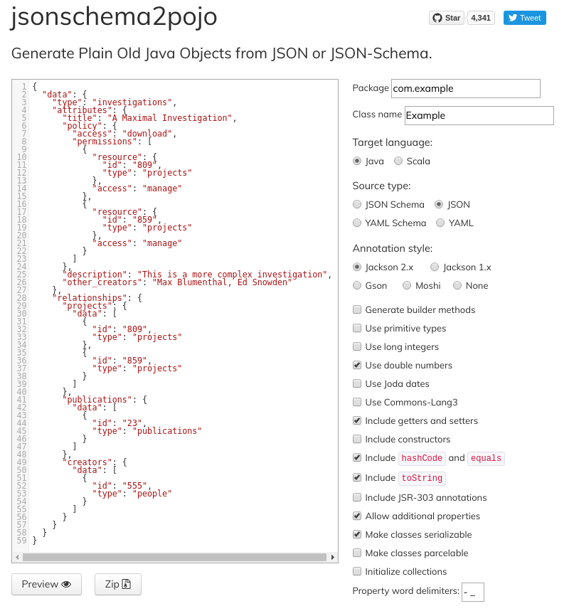

# Seek-Java-RESTClient
Library of artifacts for integration with Seek4Science using Seek's REST API

This library provides a collection of Java Bean domain entities that map to the FAIRDOM SEEK REST API resource entity model. These Beans enable Java client applications to easily retrieve, submit and update resources through the SEEK API using an Object-Oriented approach.

The [Jackson Project](https://github.com/FasterXML/jackson) is an essential dependency for these classes, and facilitates the object mapping of the JSON payload in the requests/responses to/from the SEEK API. The Java Bean classes themselves were automatically generated from the JSON data provided in the [FAIRDOM SEEK API documentation](https://docs.seek4science.org/tech/api/index.html), using [jsonschema2pojo](http://www.jsonschema2pojo.org/), which is an excellent online tool for converting JSON documents and schema into Java classes.

### SEEK Version Compatibility

The Java Bean classes in this library were generated using the SEEK 1.7.0 API specification.

## Using the Library

To use the library, simply clone this repository and run `mvn clean install` to install the dependency as a Maven package in your local Maven repository. Once the package is installed in your repository, import it in your Java application by adding the following dependency to your project's POM:

        <dependency>
            <groupId>ed.synthsys.seek</groupId>
            <artifactId>seek-dom</artifactId>
            <version>1.0</version>
        </dependency>
Once the dependency is available in your Java project, all API functions are exposed through the `ed.synthsys.seek.client.SeekRestApiClient` main client class. A client object should be instantiated with the base URI of the SEEK REST API - for example, `https://fairdomhub.org/` for the public FAIRDOMHub repository - and your username and password, as specified by the `SeekRestApiClient(String baseSeekURI, String userName, String password)` constructor (or you can provide the credentials using login method). After construction, invoke the API methods such as `getStudy`, `createInvestigation` or `updateAssay`. Check the test package for examples.

## Updating the SEEK Entity Classes

In the event that the FAIRDOM SEEK REST API resource entity model changes, it might be necessary to regenerate the Java Bean classes to reflect new attributes or even model hierarchy structures. The instructions below give guidance on the procedure for regenerating the Java Bean classes:

1. Copy the application/JSON text from the SEEK API documentation. In most cases, the JSON payload for the POST request to `create` an object in SEEK is sufficient to generate a comprehensive Java Bean

2. For example, the JSON text to use for generating the Investigation class is provided by the payload at https://docs.seek4science.org/tech/api/index.html#operation/createInvestigation:

   ```
   {
     "data": {
       "type": "investigations",
       "attributes": {
         "title": "A Maximal Investigation",
         "policy": {
           "access": "download",
           "permissions": [
             {
               "resource": {
                 "id": "809",
                 "type": "projects"
               },
               "access": "manage"
             },
             {
               "resource": {
                 "id": "859",
                 "type": "projects"
               },
               "access": "manage"
             }
           ]
         },
         "description": "This is a more complex investigation",
         "other_creators": "Max Blumenthal, Ed Snowden"
       },
       "relationships": {
         "projects": {
           "data": [
             {
               "id": "809",
               "type": "projects"
             },
             {
               "id": "859",
               "type": "projects"
             }
           ]
         },
         "publications": {
           "data": [
             {
               "id": "23",
               "type": "publications"
             }
           ]
         },
         "creators": {
           "data": [
             {
               "id": "555",
               "type": "people"
             }
           ]
         }
       }
     }
   }
   ```

3. Copy this JSON text and paste it into the text area at http://www.jsonschema2pojo.org/

4. Select 'JSON' for the 'Source type', 'Java' for the 'Target language' and 'Jackson 2.x' for the 'Annotation style'

5. Check any desired additional preferences from the check boxes: 'Include `hashcode` and `equals`' , 'Include `toString`' and 'Make classes serializable' are recommended options

6. Click on the 'Zip' button to download the generated classes



